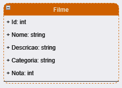
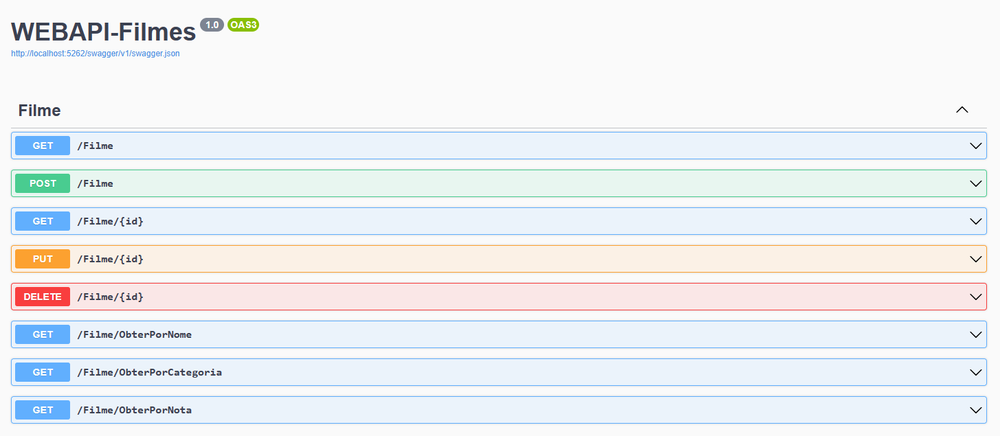

# DIO - Trilha .NET - API e Entity Framework

## **Desafio de projeto**
Para este desafio, vou usar meus conhecimentos adquiridos no módulo de API e Entity Framework.

## **Contexto**
Vou precisar construir um sistema gerenciador de tarefas, onde vou poder cadastrar uma lista de tarefas que permitirá organizar melhor a minha rotina.

Essa lista de tarefas precisa ter um CRUD, ou seja, deverá permitir obter os registros, criar, salvar e deletar esses registros.

A será do tipo Web API.

A sua classe principal, a classe de tarefa, deve ser a seguinte:




## **Swagger**




**Endpoints**


| Verbo  | Endpoint                | Parâmetro | Body          |
|--------|-------------------------|-----------|---------------|
| GET    | /Tarefa/{id}            | id        | N/A           |
| PUT    | /Tarefa/{id}            | id        | Schema Tarefa |
| DELETE | /Tarefa/{id}            | id        | N/A           |
| GET    | /Tarefa/ObterTodos      | N/A       | N/A           |
| GET    | /Tarefa/ObterPorTitulo  | titulo    | N/A           |
| GET    | /Tarefa/ObterPorData    | data      | N/A           |
| GET    | /Tarefa/ObterPorStatus  | status    | N/A           |
| POST   | /Tarefa                 | N/A       | Schema Tarefa |

Esse é o schema (model) de Tarefa, utilizado para passar para os métodos que exigirem

```json
{
  "id": 0,
  "titulo": "string",
  "descricao": "string",
  "data": "2022-06-08T01:31:07.056Z",
  "status": "Pendente"
}
```